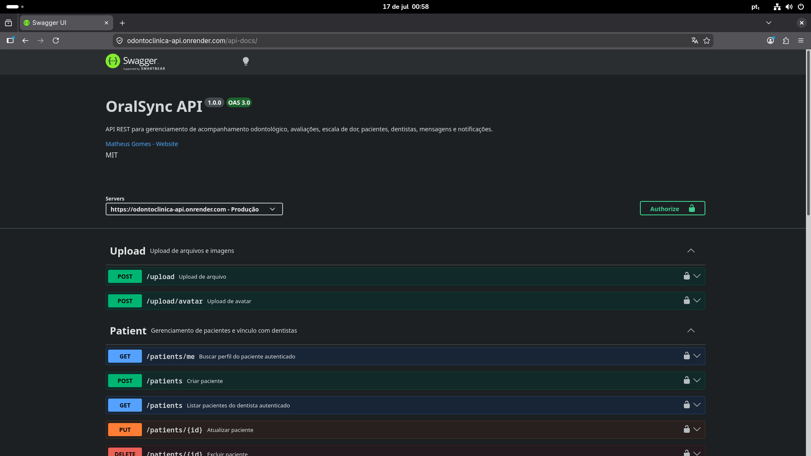

# OdontoClínica API — Backend 🦷

Backend REST API desenvolvida para gerenciamento de acompanhamento odontológico, permitindo comunicação entre dentistas e pacientes, registro de avaliações clínicas, acompanhamento da escala de dor, gerenciamento de usuários, notificações e comunicação entre usuários.

---

# 🌐 Deploy

API disponível em produção:

🔗 https://odontoclinica-api.onrender.com

Documentação Swagger/OpenAPI:

🔗 https://odontoclinica-api.onrender.com/api-docs

---

# 🚀 Tech Stack

## Backend

- Node.js
- TypeScript
- Express.js
- REST API
- Prisma ORM
- PostgreSQL
- JWT Authentication
- Socket.IO
- Swagger / OpenAPI
- Jest
- Supertest
- Docker


---

# 📌 Funcionalidades

## 🔐 Autenticação

- Cadastro de dentistas
- Cadastro de pacientes
- Login com JWT
- Controle de acesso por perfil:

  - Dentist
  - Patient


---

## 👥 Gestão de pacientes

Dentistas podem:

- Criar pacientes
- Visualizar pacientes cadastrados
- Atualizar dados dos pacientes
- Remover pacientes

Cada paciente pertence a apenas um dentista.


---

## 🦷 Avaliação odontológica

Permite:

- Criar acompanhamento odontológico
- Definir período de acompanhamento
- Consultar histórico de avaliações


---

## 📈 Escala de dor

Pacientes podem registrar diariamente:

- Escala de dor
- Comentários
- Imagens da região acompanhada

Dentistas podem visualizar o histórico para acompanhamento da evolução clínica.


---

## 💬 Comunicação entre usuários

Sistema de mensagens entre paciente e dentista.

Implementado utilizando:

- Persistência de mensagens via API REST
- Comunicação bidirecional entre usuários
- Histórico de conversas
- Sistema de notificações integrado

A comunicação em tempo real utilizando Socket.IO está preparada na arquitetura e será validada/evoluída na próxima etapa.


---

## 🔔 Notificações

Sistema de notificações:

- Contagem de mensagens/eventos não lidos
- Marcação de notificações como lidas
- Integração com comunicação entre usuários


---

## 📁 Upload de arquivos

Suporte para:

- Upload de imagens clínicas
- Upload de avatar dos usuários
- Geração de URLs públicas para arquivos
- Upload utilizando multipart/form-data
- Associação das imagens aos registros clínicos
- Persistência das URLs no banco de dados


---

# 📐 Arquitetura

O projeto segue uma arquitetura organizada por responsabilidades:

```
src
├── controllers        # Entrada HTTP e respostas da API
├── routes             # Definição dos endpoints
├── services           # Regras de negócio
├── repositories       # Camada de acesso aos dados
├── middlewares        # Autenticação e validações
├── validators         # Validações específicas
├── config             # Configurações da aplicação
├── lib                # Clientes externos (Prisma)
├── utils              # Funções auxiliares
├── socket.ts          # Comunicação Socket.IO
└── index.ts           # Inicialização da aplicação
```


---

# 🗄️ Banco de Dados

Utiliza PostgreSQL com Prisma ORM.

Principais entidades:

- Dentist
- Patient
- Evaluation
- PainScaleEntry
- Message
- Notification


As migrations são gerenciadas pelo Prisma.


Relacionamentos principais:

- Dentist possui múltiplos Patients
- Patient possui avaliações odontológicas
- Evaluation possui registros de escala de dor
- Dentist e Patient possuem comunicação por mensagens
- Usuários possuem notificações associadas


---

# 🔐 Segurança

Implementado:

- JWT Authentication
- Middleware de autenticação
- Controle de permissões por papel
- Proteção de rotas privadas


Exemplo:

```
Dentist
 └── cria e acompanha pacientes

Patient
 └── envia registros de evolução
```


---

# 🧪 Testes

A aplicação possui testes automatizados utilizando:

- Jest
- Supertest


Testes implementados:

- Auth integration tests
- Dentist integration tests
- Patient integration tests
- Evaluation integration tests
- Pain Scale integration tests
- Message integration tests
- Notification integration tests
- Upload integration tests
- Middleware unit tests
- Service unit tests


Executar testes:

```bash
npm test
```


---


---

# 🔎 Validação da API

A API foi validada manualmente utilizando Bruno API Client.

Fluxos testados:

- Autenticação completa (Dentista e Paciente)
- Criação e gerenciamento de pacientes
- Criação de avaliações odontológicas
- Registro de escala de dor com upload de imagens
- Upload de avatar dos usuários
- Comunicação entre pacientes e dentistas
- Sistema de notificações

Ambiente validado:

- API em produção (Render)
- Banco PostgreSQL em produção
- Swagger/OpenAPI funcionando


---

# 📚 Documentação da API

A API possui documentação Swagger/OpenAPI.

Produção:

```
https://odontoclinica-api.onrender.com/api-docs
```

Preview:




---

# 📮 Bruno Collection

A API possui uma coleção Bruno para testes dos principais fluxos:

- Authentication
- Patients
- Evaluations
- Pain Scale
- Messages
- Notifications
- Upload

A coleção está disponível em: /docs/bruno/oralsync-api


---

# 🐳 Executando localmente

## Instalar dependências

```bash
npm install
```


## Configurar ambiente

Criar arquivo:

```
.env
```

com:

```
DATABASE_URL=
JWT_SECRET=
FRONTEND_URL=
API_URL=
```


## Executar migrations

```bash
npx prisma migrate dev
```


## Iniciar aplicação

```bash
npm run dev
```


---

# 📦 Scripts

```bash
npm run dev       # Ambiente de desenvolvimento

npm run build     # Build TypeScript

npm test          # Executa testes automatizados
```


---

# 📡 API Overview

## Auth

```
POST /auth/signup/dentist

POST /auth/signup/patient

POST /auth/login
```


## Dentist

```
GET /dentists/me

PUT /dentists/{id}

DELETE /dentists/{id}
```


## Patient

```
GET /patients/me

POST /patients

GET /patients

PUT /patients/{id}

DELETE /patients/{id}
```


## Evaluation

```
POST /evaluations/{patientId}

GET /evaluations/patient/{patientId}
```


## Pain Scale

```
POST /pain-scale

GET /pain-scale/patient/{patientId}
```


## Messages

```
POST /messages/send

GET /messages
```


## Notifications

```
GET /notifications/unread-count

PATCH /notifications/read-all
```


## Upload

```
POST /upload

POST /upload/avatar
```


---

# 🧠 Conceitos aplicados

- Clean Code
- SOLID
- Separation of Concerns
- Domain-oriented architecture
- REST API Design
- API-first development
- Automated testing
- Event-driven communication
- Database modeling
- Layered architecture


---

# 📄 License

Projeto desenvolvido para fins acadêmicos e profissionais.