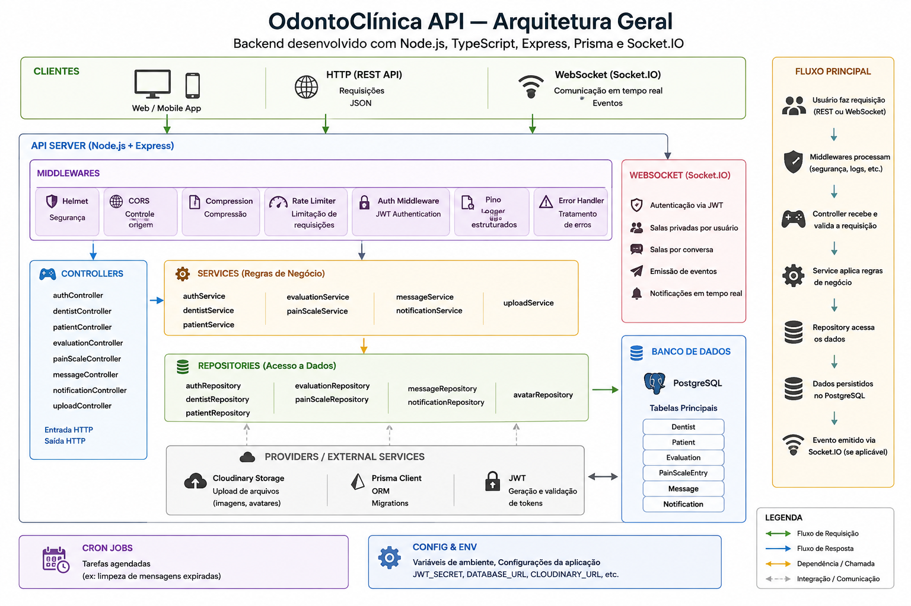
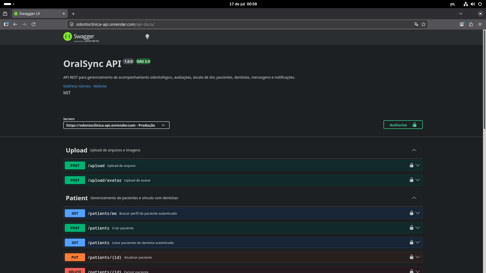

# OdontoClínica API — Backend 🦷

Backend REST API desenvolvida para gerenciamento de acompanhamento odontológico, permitindo comunicação entre dentistas e pacientes, registro de avaliações clínicas, acompanhamento da escala de dor, gerenciamento de usuários, notificações e comunicação entre usuários.

---

# 🌐 Deploy

API disponível em produção:

🔗 https://odontoclinica-api.onrender.com

Documentação Swagger/OpenAPI:

🔗 https://odontoclinica-api.onrender.com/api-docs

---

# 🚀 Tech Stack

## Backend

- Node.js
- TypeScript
- Express.js
- REST API
- Prisma ORM
- PostgreSQL
- JWT Authentication
- Socket.IO
- Swagger / OpenAPI
- Jest
- Supertest
- Docker


---

# 🏗 Arquitetura

<p align="center">
  
</p>

O projeto foi desenvolvido seguindo princípios modernos de arquitetura backend para aplicações Node.js, priorizando baixo acoplamento, alta coesão e facilidade de manutenção.

Principais padrões utilizados:

- Dependency Injection (DI)
- Repository Pattern
- Service Layer
- Controller Layer
- Provider Pattern
- Middleware Pattern
- Clean Code
- SOLID
- Separation of Concerns

Cada camada possui responsabilidade única, tornando o sistema mais testável, escalável e de fácil evolução.


---

# 📌 Funcionalidades

## 🔐 Autenticação

- Cadastro de dentistas
- Cadastro de pacientes
- Login com JWT
- Controle de acesso por perfil:

  - Dentist
  - Patient


---

## 👥 Gestão de pacientes

Dentistas podem:

- Criar pacientes
- Visualizar pacientes cadastrados
- Atualizar dados dos pacientes
- Remover pacientes

Cada paciente pertence a apenas um dentista.


---

## 🦷 Avaliação odontológica

Permite:

- Criar acompanhamento odontológico
- Definir período de acompanhamento
- Consultar histórico de avaliações


---

## 📈 Escala de dor

Pacientes podem registrar diariamente:

- Escala de dor
- Comentários
- Imagens da região acompanhada

Dentistas podem visualizar o histórico para acompanhamento da evolução clínica.


---

## 💬 Comunicação em tempo real

O sistema possui comunicação em tempo real utilizando Socket.IO autenticado com JWT.

Recursos implementados:

- Chat entre dentista e paciente
- Histórico persistido em PostgreSQL
- Salas privadas por usuário
- Salas específicas por conversa
- Autenticação via JWT durante o handshake
- Reconexão automática suportada pelo cliente
- Notificações em tempo real
- Comunicação REST + WebSocket

Fluxo:

REST API
↓
Persistência da mensagem
↓
Persistência da notificação
↓
Socket.IO
↓
Atualização imediata do frontend

---

## 🔔 Sistema de notificações

Notificações persistidas no banco de dados.

Recursos:

- Contador de notificações não lidas
- Marcação de notificações como lidas
- Atualização em tempo real via Socket.IO
- Histórico persistido
- Integração com o módulo de mensagens


---

## 📁 Upload de arquivos

Suporte para:

- Upload de imagens clínicas
- Upload de avatar dos usuários
- Geração de URLs públicas para arquivos
- Upload utilizando multipart/form-data
- Associação das imagens aos registros clínicos
- Persistência das URLs no banco de dados


---

# 📐 Estrutura de diretórios

O projeto segue uma arquitetura organizada por responsabilidades:

```
src
├── config
├── container
├── controllers
├── cron
├── errors
├── lib
├── middlewares
├── providers
│   └── storage
├── repositories
├── routes
├── services
├── socket.ts
├── types
├── utils
├── validators
├── app.ts
└── index.ts

```


---

# ⚙ Infraestrutura

A aplicação utiliza diversos componentes para garantir desempenho, segurança e organização:

- Docker
- Docker Compose
- PostgreSQL
- Prisma ORM
- Cloudinary
- Swagger
- Socket.IO
- Pino Logger
- Helmet
- Compression
- CORS
- Rate Limiter
- Graceful Shutdown

---

# 🗄️ Banco de Dados

Utiliza PostgreSQL com Prisma ORM.

Principais entidades:

- Dentist
- Patient
- Evaluation
- PainScaleEntry
- Message
- Notification


As migrations são gerenciadas pelo Prisma.


Relacionamentos principais:

- Dentist possui múltiplos Patients
- Patient possui avaliações odontológicas
- Evaluation possui registros de escala de dor
- Dentist e Patient possuem comunicação por mensagens
- Usuários possuem notificações associadas


---

# 🔐 Segurança

Recursos implementados:

- JWT Authentication
- Middleware de autenticação
- Controle de acesso baseado em papéis
- Proteção de rotas privadas
- Helmet
- Rate Limiter
- CORS configurável
- Validação de tokens também para Socket.IO


Exemplo:

```
Dentist
 └── cria e acompanha pacientes

Patient
 └── envia registros de evolução
```


---

# 🧪 Testes

A aplicação possui testes automatizados cobrindo regras de negócio e fluxos completos da API.

Ferramentas:

- Jest
- Supertest
- Bruno API Client

Cobertura:

- Autenticação
- Pacientes
- Dentistas
- Avaliações
- Escala de dor
- Upload
- Mensagens
- Notificações
- Middlewares
- Services

Além dos testes automatizados, todos os endpoints foram validados manualmente em ambiente de produção utilizando Bruno.


Executar testes:

```bash
npm test
```


---


---

# 🔎 Validação da API

A API foi validada manualmente utilizando Bruno API Client.

Fluxos testados:

- Autenticação completa (Dentista e Paciente)
- Criação e gerenciamento de pacientes
- Criação de avaliações odontológicas
- Registro de escala de dor com upload de imagens
- Upload de avatar dos usuários
- Comunicação entre pacientes e dentistas
- Sistema de notificações

Ambiente validado:

- API em produção (Render)
- Banco PostgreSQL em produção
- Swagger/OpenAPI funcionando


---

# 📚 Documentação da API

A API possui documentação Swagger/OpenAPI.

Produção:

```
https://odontoclinica-api.onrender.com/api-docs
```

Preview:




---

# 📮 Bruno Collection

A API possui uma coleção Bruno para testes dos principais fluxos:

- Authentication
- Patients
- Evaluations
- Pain Scale
- Messages
- Notifications
- Upload

A coleção está disponível em: /docs/bruno/oralsync-api


---

# 🐳 Executando localmente

## Instalar dependências

```bash
npm install
```


## Configurar ambiente

Criar arquivo:

```
.env
```

com:

```
DATABASE_URL=
JWT_SECRET=
FRONTEND_URL=
API_URL=
```


## Executar migrations

```bash
npx prisma migrate dev
```


## Iniciar aplicação

```bash
npm run dev
```


---

# 📦 Scripts

```bash
npm run dev

npm run build

npm start

npm test

npm run lint

npm run prisma:generate

npm run prisma:migrate
```


---

# 📡 API Overview

## Auth

```
POST /auth/signup/dentist

POST /auth/signup/patient

POST /auth/login
```


## Dentist

```
GET /dentists/me

PUT /dentists/{id}

DELETE /dentists/{id}
```


## Patient

```
GET /patients/me

POST /patients

GET /patients

PUT /patients/{id}

DELETE /patients/{id}
```


## Evaluation

```
POST /evaluations/{patientId}

GET /evaluations/patient/{patientId}
```


## Pain Scale

```
POST /pain-scale

GET /pain-scale/patient/{patientId}
```


## Messages

```
POST /messages/send

GET /messages
```


## Notifications

```
GET /notifications/unread-count

PATCH /notifications/read-all
```


## Upload

```
POST /upload

POST /upload/avatar
```


---

# 🧠 Conceitos aplicados

- SOLID
- Clean Architecture
- Clean Code
- Repository Pattern
- Dependency Injection
- Service Layer
- Provider Pattern
- RESTful API
- JWT Authentication
- WebSocket (Socket.IO)
- Event-driven communication
- Separation of Concerns
- API-first Development
- OpenAPI (Swagger)
- ORM (Prisma)
- Automated Tests
- Docker


---

# 📄 Sobre o projeto

OralSync é uma API desenvolvida para gerenciamento de acompanhamento odontológico, permitindo comunicação em tempo real entre dentistas e pacientes, acompanhamento clínico e monitoramento da evolução do tratamento.

O projeto foi desenvolvido como evolução contínua do sistema original, adotando princípios modernos de arquitetura de software, testes automatizados, documentação OpenAPI e comunicação em tempo real utilizando Socket.IO.

Atualmente o projeto demonstra a aplicação prática de conceitos de engenharia de software voltados para ambientes profissionais.